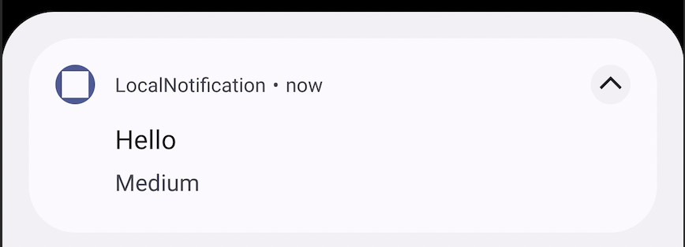
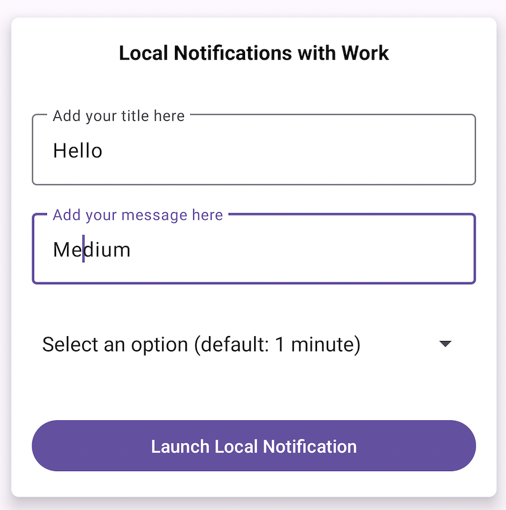
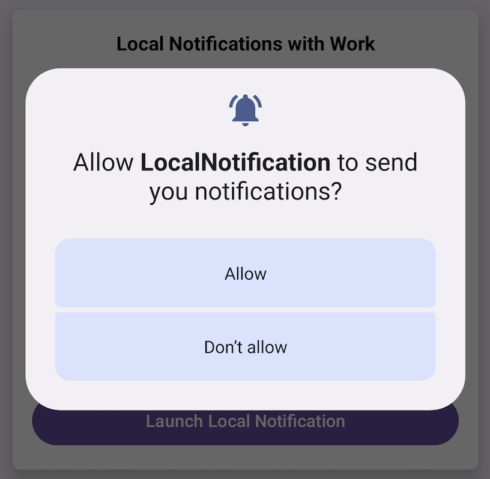

<h1 align="center">Local Notification</h1> 

<p align="center">
This app was created to learn more about Local notifications in Android
</p>

## Installation

Clone this repository and import into **Android Studio**

```bash
git clone https://github.com/munbonecci/LocalNotification.git
```

## Build variants

Use the Android Studio *Build Variants* button to choose between **debug** and **release**
flavors

## Maintainers

This project is maintained by:

* [Edmundo Bonequi](http://github.com/munbonecci)

## Built with

- [Kotlin](https://kotlinlang.org/) - For coding.
- [WorkManager](https://developer.android.com/jetpack/androidx/releases/work) - For schedule deferrable 
asynchronous tasks that must be executed reliably.
- [Notification](https://developer.android.com/develop/ui/views/notifications/build-notification) - For local notifications.

## How I run the app?

- Clone the repository
- Open it in Android Studio
- Wait until dependencies are installed
- Run app in your emulator or physical device



